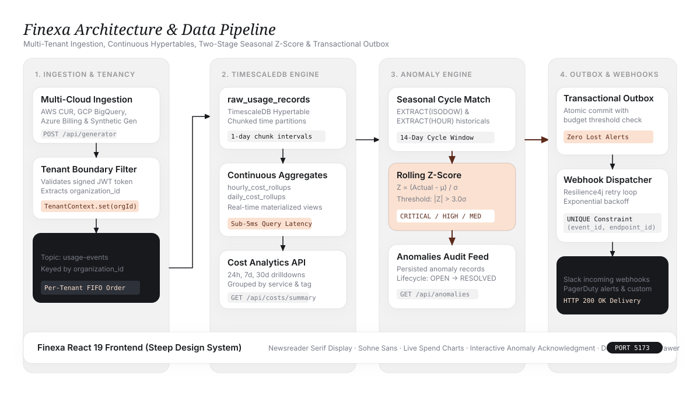
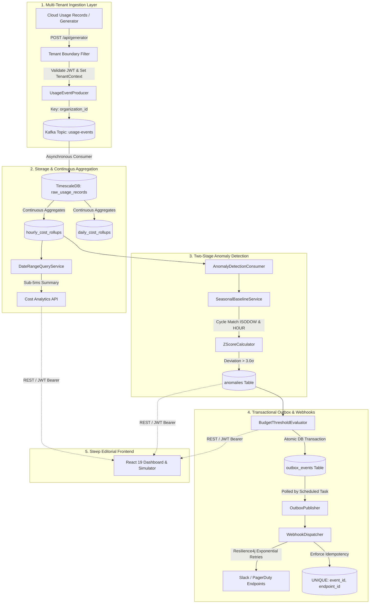

# Finexa — Streaming Multi-Tenant FinOps Platform

<div align="center">
  <p><strong>Cloud cost intelligence, continuous TimescaleDB rollups, two-stage seasonal Z-score anomaly detection, and transactional outbox webhooks.</strong></p>
  
  <p>
    
    
    
    
    
    
    
  </p>
</div>

---

## 🏛️ System Architecture





---

## 💡 What Problem Finexa Solves

| Traditional Cloud Cost Monitoring | Finexa Engineering Approach |
| :--- | :--- |
| **End-of-Month Invoice Shock**: Teams learn about a runaway autoscaling loop 30 days after it began when the AWS/GCP bill arrives. | **Streaming Sub-Second Ingestion**: Ingests raw events continuously via Apache Kafka, detecting anomalies within seconds of occurrence. |
| **Static Alert Fatigue**: Naive threshold alerts (e.g., "$200/hr") page on-call engineers during expected peak weekday traffic and miss real anomalies on quiet weekends. | **Two-Stage Seasonal Cycle Matching**: Compares spend against identical historical weekday/hour windows (e.g., Tuesday 14:00 vs. past Tuesdays at 14:00) before computing rolling Z-scores. |
| **Database Lockup on Raw Log Scans**: Querying millions of JSON usage records over 30 days causes full table scans and high database load. | **TimescaleDB Continuous Aggregates**: Real-time materialized hypertables pre-compute hourly and daily rollups with sub-5ms query response times. |
| **Lost or Duplicate Alert Webhooks**: Network blips drop webhook alerts, or retry storms flood Slack channels with duplicate incident alerts. | **Transactional Outbox + Resilience4j + Idempotency**: Alert records commit atomically in PostgreSQL; dispatchers enforce database-level `UNIQUE(event_id, endpoint_id)` constraints. |
| **Multi-Tenant Data Leaks**: Relying solely on client-supplied parameters for isolation risks cross-tenant data exposure. | **Enforced Tenant Boundaries**: Request-scoped `TenantContext` populated strictly from verified JWT claims; tenant parameters cannot be overridden by clients. |

---

## 🚀 Key Capabilities

1. **Multi-Tenant Ingestion Pipeline**:
   - High-throughput Kafka topic `usage-events` partitioned by `organization_id` for per-tenant FIFO event processing.
2. **Continuous TimescaleDB Rollups**:
   - `raw_usage_records` partitioned into 1-day hypertable chunks with automated continuous aggregates for hourly and daily views.
3. **Two-Stage Seasonal Anomaly Engine**:
   - **Stage 1**: Queries a 14-day historical baseline matching the exact `EXTRACT(ISODOW)` and `EXTRACT(HOUR)`.
   - **Stage 2**: Computes rolling Z-Score $Z = \frac{x - \mu}{\sigma}$. Flags deviations $> 3.0\sigma$ with severity tiers (`CRITICAL`, `HIGH`, `MEDIUM`).
4. **Transactional Outbox Reliability Layer**:
   - Budget threshold checks write to `outbox_events` in the exact same database transaction as the cost evaluation.
   - `WebhookDispatcher` executes HTTP dispatches with Resilience4j exponential backoff, dead-letter recording, and duplicate prevention.
5. **Interactive Failure & Workload Simulator**:
   - Built-in workload generator capable of injecting 14-day historical baselines, backfilling multi-cloud usage (EC2, RDS, S3, CloudFront), and triggering artificial runaway compute spikes ($450.00/hr vs. $75.20/hr).
6. **Steep Editorial Frontend**:
   - Built with React 19, Tailwind CSS, Framer Motion, and Recharts, adhering to the Steep design specification (*"serif analytics on warm paper"*).

---

## 🛠️ Tech Stack

| Layer | Technologies |
| :--- | :--- |
| **Backend Framework** | Spring Boot 3.3.x, Java 21 (Records, Virtual Threads, Pattern Matching) |
| **Data Storage & Hypertables** | TimescaleDB / PostgreSQL 16, Flyway Migrations |
| **Message Streaming** | Apache Kafka 3.7 (KRaft mode, no Zookeeper dependency) |
| **Caching & Tokens** | Redis 7 (Session revocation, tenant rate-limiting) |
| **Security & Auth** | Spring Security 6, Stateless JWT (HMAC-SHA256), Method-level RBAC (`@PreAuthorize`) |
| **Reliability & Resilience** | Resilience4j Retry, Transactional Outbox Pattern |
| **Frontend Application** | React 19, Vite, Tailwind CSS, Framer Motion, Lucide Icons, Recharts |
| **Documentation & Metrics** | OpenAPI 3.1 (Springdoc Swagger UI), Spring Boot Actuator, Micrometer Prometheus |

---

## 📡 API Reference & Endpoints

### 1. Tenancy & Authentication
| Method | Endpoint | Description | Auth Required |
| :--- | :--- | :--- | :--- |
| `POST` | `/api/orgs/register` | Register a new organization and default OWNER user | No |
| `POST` | `/api/auth/login` | Authenticate user and receive signed JWT Bearer token | No |
| `POST` | `/api/orgs/users` | Add a new team member with role (`ADMIN`, `VIEWER`) | `OWNER`, `ADMIN` |
| `GET` | `/api/orgs/users` | List all users belonging to the active organization | Yes |

### 2. Cost Analytics & Continuous Aggregates
| Method | Endpoint | Description | Parameters |
| :--- | :--- | :--- | :--- |
| `GET` | `/api/costs/summary` | Query total period spend, previous delta, and top service | `from`, `to` |
| `GET` | `/api/costs/timeseries` | Retrieve hourly/daily aggregated spend for charts | `from`, `to`, `interval` |
| `GET` | `/api/costs/breakdown` | Grouped cost allocation across multi-cloud services | `from`, `to` |

### 3. Anomaly Detection
| Method | Endpoint | Description | Parameters |
| :--- | :--- | :--- | :--- |
| `GET` | `/api/anomalies` | List detected anomalies with severity and baseline diff | `status` (OPEN/RESOLVED) |
| `POST` | `/api/anomalies/{id}/acknowledge` | Mark an anomaly as acknowledged by on-call | None |
| `POST` | `/api/anomalies/{id}/resolve` | Resolve an anomaly with post-mortem resolution note | JSON body |

### 4. Budgets & Webhook Reliability
| Method | Endpoint | Description | Auth Required |
| :--- | :--- | :--- | :--- |
| `GET` | `/api/budgets` | Fetch active organization budgets, spend caps, and alert thresholds | Yes |
| `POST` | `/api/budgets` | Create or update a budget cap for a specific service scope | `OWNER`, `ADMIN` |
| `POST` | `/api/webhooks/endpoints` | Register a Slack/PagerDuty webhook destination | `OWNER`, `ADMIN` |
| `GET` | `/api/webhooks/deliveries` | Audit log of all webhook deliveries, retries, and HTTP response codes | Yes |

### 5. Workload Generator & Failure Simulator
| Method | Endpoint | Description | Parameters |
| :--- | :--- | :--- | :--- |
| `POST` | `/api/generator/backfill` | Seed synthetic 14-day multi-cloud historical baselines | `days`, `services` |
| `POST` | `/api/generator/spike` | Inject an instant runaway compute spike (e.g., $450/hr on EC2) | `service`, `hourlyCost` |

---

## ⚡ Quickstart & Local Setup

### Prerequisites
- **Java 21 JDK** installed
- **Node.js 18+** & npm installed
- **Docker & Docker Compose** installed

### Step 1: Start Infrastructure (TimescaleDB, Kafka, Redis)
```bash
docker compose up -d
```
*TimescaleDB will be available on port `5432`, Apache Kafka on `9092`, and Redis on `6379`.*

### Step 2: Build & Run the Backend
```bash
./gradlew bootRun
```
*The Spring Boot server starts on `http://localhost:8080`.*
- Swagger UI Documentation: `http://localhost:8080/swagger-ui.html`
- Health Check: `http://localhost:8080/actuator/health`

### Step 3: Run the React Frontend
```bash
cd frontend
npm install
npm run dev
```
*Open `http://localhost:5173` in your browser.*

---

## 🔑 Pre-Seeded Demo Accounts

You can test the multi-tenant RBAC system using the following credentials:

| Organization | Email | Password | Role |
| :--- | :--- | :--- | :--- |
| **Acme Cloud Solutions** | `owner@acme.com` | `super-secure-password-123` | **OWNER** (Full Access) |
| **Acme Cloud Solutions** | `admin@acme.com` | `admin-secure-password-123` | **ADMIN** (Budgets & Webhooks) |
| **Acme Cloud Solutions** | `viewer@acme.com` | `viewer-password-123` | **VIEWER** (Read-Only) |

---

## 🧪 Testing & Verification

The project includes an automated test suite verifying all 5 core subsystems:

```bash
./gradlew test
```

### Verified Test Suites:
- `AuthAndTenantIntegrationTests`: Validates tenant isolation, JWT claims extraction, and RBAC rejection.
- `KafkaIngestionAndAggregationIntegrationTests`: Verifies Kafka event publishing, hypertable ingestion, and continuous aggregate queries.
- `AnomalyDetectionIntegrationTests`: Tests seasonal cycle matching, $Z$-Score calculation, and severity classification.
- `ReliabilityAndOutboxIntegrationTests`: Validates atomic outbox persistence, Resilience4j exponential retries, and database idempotency constraints.
- `EndToEndBackendFlowIntegrationTests`: Full end-to-end integration test simulating the entire workflow from ingestion to anomaly detection and outbox dispatch.

---

## 📄 License & Attribution

Built for modern engineering teams demanding deterministic cloud cost intelligence.
Licensed under the [Apache 2.0 License](LICENSE).
